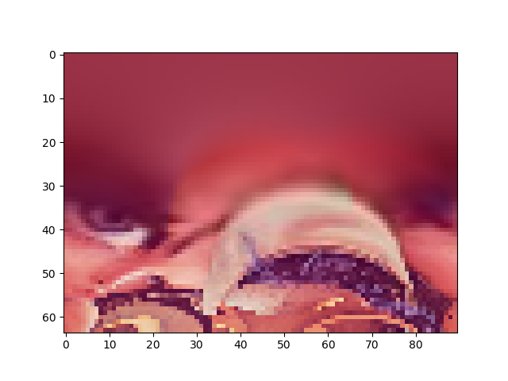
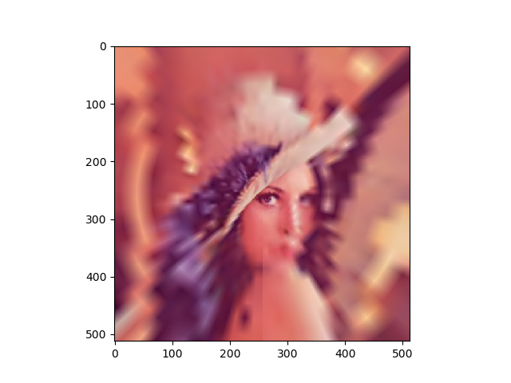

# logpolar_mapping
Log Polar Mapping Example in Python

Used in example to better vizualize what a convolution over that space does in Cartesian space.

And an example of a polar mapping (x axis = angle, y axis = log(radius)):

And a reconstruction of the polar mapping:

